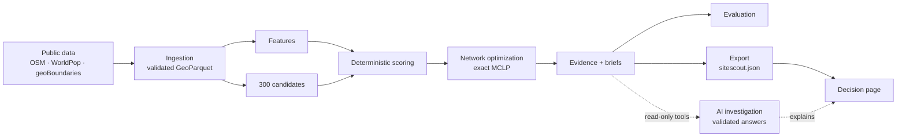

# SiteScout

**EV charging network intelligence for Rwanda.** An independent project built on public data.

SiteScout answers one question: **where should an EV charging company expand next in Rwanda?** It proposes a network of 30 charging sites, selected together rather than as isolated points, explains why each site was selected, states what is still unknown, and says what should be investigated next.

**Key result.** Choosing 30 sites jointly covers **49.8%** of Rwanda's modelled population within 10 km, against **40.9%** for the top-scoring sites kept at least 5 km apart and **24.0%** for the 30 top-scoring sites taken as-is ([reports/evaluation.md](reports/evaluation.md), sections C and F). Most of the gain comes from spreading sites out; exact optimization adds about 9 points and removes the need to hand-tune a spacing distance (a 10 km spacing reaches 46.6% but places only 27 sites).

**What makes it technically interesting**

- **A network problem, solved exactly.** The 30 sites are a Maximum Coverage Location Problem solved with PuLP and CBC, always compared with a greedy heuristic and the naive Top-30 by score.
- **Deterministic computation, typed evidence.** Scores and network selection are computed deterministically; the parameters (weights, radius, candidate rules) are documented design choices in [docs/decisions.md](docs/decisions.md). Every displayed value is an evidence record typed RETRIEVED_FACT, CALCULATED, INFERRED or UNKNOWN. The AI layer explains results and never changes them.
- **Evaluated, with its limits stated.** A retrospective plausibility test against random and population-only baselines, weight stability, data-quality checks, and a grounding check on every number in the site briefs.
- **AI explains the decision; it does not make it.** An agent investigates the result with SiteScout's own read-only tools and documents, and a deterministic validator checks every statement it writes before anything is shown.

Start with the [case study](docs/case_study.md), then the [demo script](docs/demo_script.md).

## Key results

| | Optimized (exact MCLP) | Greedy | Top-30 by score |
|---|---|---|---|
| Modelled population within 10 km | **49.8%** | 49.2% | 24.0% |
| Provinces with a site | 5 | 5 | 4 |
| Districts with a site | 22 | 23 | 8 |
| Mean site score | 64.6 | 65.3 | 73.8 |

Coverage is modelled population within the service radius under the stated assumptions, not charger use. The Top-30 baseline takes the 30 highest-scoring of the 108 eligible sites with no spacing rule, so it clusters (23 of 30 in the City of Kigali), and greedy reaches 49.2%. The 10 km radius is an assumption: re-solved at 5 km and 15 km, the optimized network covers 26.3% and 68.9%. [Section F of reports/evaluation.md](reports/evaluation.md) repeats the comparison at 5 to 15 km against a stronger baseline that takes the highest scores but keeps sites 5 or 10 km apart: Optimized stays ahead at every radius, but by 2.0 to 4.8 points over the strongest baseline (3.2 at 10 km, where that baseline places only 27 of 30 sites), not by the 25.8 points it leads the naive Top-30. The exact solution is optimal and greedy comes within 0.64% of its objective. The ranking is stable under ±20% changes to each weight (mean Top-30 overlap 0.98). The public OpenStreetMap data used maps only 5 charging sites, so the backtest cannot distinguish SiteScout from population alone (the 95% interval of the difference includes zero). [reports/evaluation.md](reports/evaluation.md) reports this. All 2262 numbers in the 30 site briefs trace to structured evidence.

## Architecture



Python in `src/sitescout/` computes every score and the network selection; the parameters are documented design choices ([docs/decisions.md](docs/decisions.md)). The page in `app/` renders the export and computes nothing. The investigation layer calls the same deterministic tools; it never produces a number, changes a score or selects a site.

## Run the demo

**The decision view** needs nothing installed: open `app/index.html` in a browser. It reads the committed `data/export/sitescout.js` and shows the map, the three selections (Optimized, Greedy, Top-30 by score) and every site's score, evidence, unknowns and next actions.

**The AI investigation** runs locally and needs the pipeline outputs in `data/processed/` (see [Setup](#setup)), the optional extra and an OpenAI API key:

```bash
uv sync --extra analyst
# put OPENAI_API_KEY=... in a local .env file (gitignored; SiteScout never reads it itself)
uv run --env-file .env python scripts/serve.py
```

Then open http://127.0.0.1:8765/. On the overview, **Investigate network difference** asks why the optimized network differs from the Top-30 by score; on a site you can investigate the site, have an evidence group explained, or ask what would need to be verified. The page sends a fixed investigation type, never free text. Each answer shows the records and document passages it cites and the steps the agent took. If no answer passes validation after one retry, the page shows the retrieved evidence instead of generated text. Run this way, the server listens on 127.0.0.1 only (the public deployment behind the GitHub Pages copy is [D-066](docs/decisions.md)), the key never reaches the browser, and nothing an investigation returns is saved ([D-062](docs/decisions.md), [D-064](docs/decisions.md)).

## What it answers

1. Which locations deserve investigation?
2. Why is each one attractive, and what evidence supports that?
3. What is still unknown?
4. Which 30 locations form the best network when chosen together?
5. What should be investigated next?

## What it does not claim

SiteScout never claims grid approval, transformer capacity, land availability, permit approval, owner willingness, revenue or business viability, and its ranking is not ground truth. It reports **grid evidence** from public maps, never a grid connection decision.

Briefs with evidence, unknowns and next actions exist for the 30 selected sites; the other 270 candidates have scores and a confidence level only. Every site brief carries these two statements:

> Actual grid connection feasibility requires utility confirmation.

> This analysis uses public data. It does not establish grid approval, land availability, permitting approval, or commercial viability.

Some things stay unknown for every site and are listed in every output: grid connection capacity, transformer capacity, land availability, landowner willingness and permit requirements.

Evaluation results are reported as a **retrospective plausibility test**.

## Independence and data

- SiteScout is an independent project and is not affiliated with any company. Sites carry generic labels such as "Fuel station, Remera, Gasabo", never a business or brand name.
- It uses public data only, such as OpenStreetMap, WorldPop and geoBoundaries, and never private or company operational data.
- Synthetic data, where used, is labelled synthetic.
- No datasets are stored in this repository. [docs/data_sources.md](docs/data_sources.md) lists every source, its licence and how to obtain it.

## Setup

Requires [uv](https://docs.astral.sh/uv/), which installs Python 3.12 if needed.

```bash
uv sync
uv run python scripts/check_config.py
uv run python scripts/ingest.py all
uv run python scripts/candidates.py
uv run python scripts/features.py
uv run python scripts/score.py
uv run python scripts/optimize.py
uv run python scripts/briefs.py
uv run python scripts/evaluate.py
uv run python scripts/export.py
uv run ruff check .
uv run ruff format --check .
uv run pytest -q
```

`check_config.py` validates `config/settings.yaml` and `config/weights.yaml`. `ingest.py all` downloads the public sources into `data/raw/` and builds the validated layers in `data/processed/`.

## Documentation

- [Case study](docs/case_study.md) and [demo script](docs/demo_script.md)
- [Methodology](docs/methodology.md), the full [specification](docs/SPEC.md), [architecture](docs/architecture.md), [features](docs/features.md) and [scoring](docs/scoring.md)
- [Design decisions and open questions](docs/decisions.md), [data sources](docs/data_sources.md)
- Reports: [evaluation](reports/evaluation.md), [site briefs](reports/briefs/README.md), [agent evaluation](reports/agent_eval.md), [live agent observation](reports/agent_live_eval.md), [demo-readiness gate](reports/demo_gate.md)

## Repository layout

```text
config/    settings.yaml and weights.yaml: every parameter, taken from docs/SPEC.md
src/       the sitescout package, where all computation lives
scripts/   entry points that parse arguments and call src/
tests/     pytest suite
docs/      specification, methodology, decisions, case study and demo script
app/       the decision page (index.html) and its optional investigation client
reports/   evaluation, the 30 site briefs, and the agent and demo-gate reports
data/      local data, never committed except the demo export and the agent's processed files
```

Built in 12 milestones, from repository setup to this demo: data ingestion, candidates, features, scoring, evaluation, network optimization, evidence, the export and page, the AI Site Analyst, the agentic investigation and packaging.

## Data credits

- Map data © OpenStreetMap contributors, available under the [Open Database License](https://www.openstreetmap.org/copyright).
- Population: WorldPop, University of Southampton (2025), constrained estimates R2025A v1, DOI 10.5258/SOTON/WP00839, [CC BY 4.0](https://hub.worldpop.org/data/licence.txt).
- Boundaries: geoBoundaries (Runfola et al. 2020), gbOpen Rwanda ADM2 and ADM1, [CC BY 4.0](https://creativecommons.org/licenses/by/4.0/).
- Transmission network (grid-evidence cross-check): World Bank Group via energydata.info, [CC BY 4.0](https://creativecommons.org/licenses/by/4.0/).

## Licence

Code and documentation: [MIT](LICENSE). Data sources keep their own licences and credits; see [docs/data_sources.md](docs/data_sources.md).
